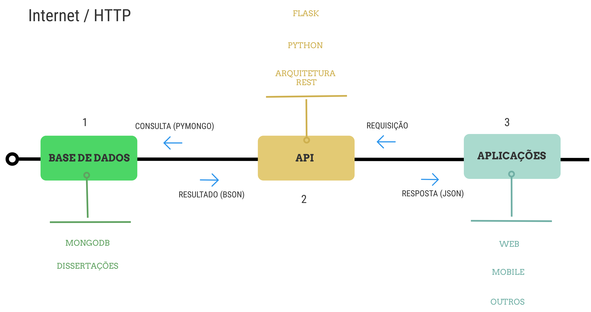

# Arquitetura e Comunicação

A figura a seguir apresenta a arquitetura de comunicação disponibilizada pela API. 

Neste modelo os elementos representam o formato de comunicação da API e são representados da seguite forma:

* Comunicação
* Banco de Dados
* API
* Aplicações

A comunicação realizada entre os elementos **BANCO DE DADOS**, **API** e **APLICAÇÕES** acontece pelo protocolo HTTP que permite a transmissão de dados de hipermídia. Em cima do protocolo de comunicação utilizado, a API utiliza o formato de arquitetura REST para  responder (*responses*) as solicitções (*requests*). A arquitetura **REST** define alguns padrões para a construção de uma interface de comunicação, oferecendo alguns benefícios na comunicação entre *softwares* na *Web*, entre eles a segurança.

O **BANCO DE DADOS** representa a base de dados utilizada pela API, que armazaena diversas dissertações utilizando o SGBD MongoDB. Fisicamente a base de dados está salva em nuvem, utilizando o Atlas, um serviço oferecido pelo projeto do MongoDB, fornecendo um *Cluster* para armazenamento de informações. As respostas fornecidas as requisições da API é em formato **BSON** (JSON Binário).

A **API** representa a aplicação construída para acessar a base de dados de forma estruturada e segura. Funcionando como uma interface de comunicação, a API faz requisiçoes ao banco de dados, através do *driver* de comunicação **PyMongo** e fornece respostas em formato *JSON*. A forma de acesso da API é aberta, ou seja, basta utilizar o *link* [api-saude-mental](https://api-saude-mental.herokuapp.com) para consumir os dados fornecidos.

O item de **APLICAÇÕES** representa outros *softwares* que podem consumir os dados fornecidos pela API. Aplicativos *mobile*, *sites* receberam o mesmo tipo de resposta ao consumirem os dados da API. A  **URL** de um recurso disponiblizada pela API é padranizada, possibilitando a comnnicação em diversas plataformas.
